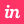

# Hello!! 

I am Shridhi, a Software Engineer at Compro Technologies and Volunteer at WWCode FrontEnd. I have been working as a front-end developer for the past few years, and seeing my work live on the web makes me happy. That is why I love FrontEnd!✨

📫 You can find me here:

<!-- 

 -->

## 🛠️ Skills

### Languages

    
    
    

### Frontend

    
    
    
    
    
    
    
    
    

### Database

### Tools

    
    
    
    
    
    
    
    
    
    
    
    

### Familiar With

    
    
    
    
    
    

